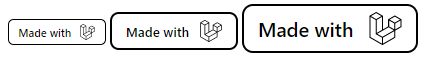
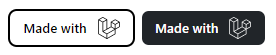

# Made-With-Collection

Made-with-collection a badge provider based on [simple-icons](https://github.com/simple-icons/simple-icons) for websites.

## Preview




## Installation

- You can install it using `npm`

```bash
npm i made-with-collection
```

- By downloading the latest release
- Or using a CDN

## Import

### Using module import

```js
import MadeWith from "path/to/dist/made-with-module.js";

// Then you can conditionnaly enable it using the 'enable' function
MadeWith.enable();
```

> ⚠ This method only works using `npm` or the latest release. If your using an external js file to write the code above, you'll need to add the `type="module"` when importing the script.

### Using a CDN

Simply link the CDN to your html page like this

```html
<script src="https://cdn.jsdelivr.net/npm/made-with-collection@latest/dist/made-with.js"></script>

<!-- Or the minified version -->
<script src="https://cdn.jsdelivr.net/npm/made-with-collection@latest/dist/made-with.min.js"></script>
```

## Usage

First, you need to provide a custom class `made-with` to detect which element needs to be converted into a made-with badge.

Then, you'll ne provide html data attributs. There are currently 3 parameters available : 

- **data-mw-icon**
- **data-mw-size**
- **data-mw-theme**

| Attribut | Values | Default |
| -------- | ------ | ------- |
|data-mw-icon| Any icon available on simple-icons|none
|data-mw-size| small, medium, large| medium|
data-mw-theme | light, dark | light|


Examples are provided onto the `/test` folder.

Hope you like it 👍